# Moon Dev EDA Implementation - Architecture & Data Flow Diagrams

**Generated**: 2025-10-26  
**Version**: 1.0.0  
**Purpose**: Visual architecture and data flow documentation using Mermaid diagrams

---

## Table of Contents

1. [System Architecture Overview](#1-system-architecture-overview)
2. [Component Architecture](#2-component-architecture)
3. [Data Flow Diagrams](#3-data-flow-diagrams)
4. [Event Flow Sequences](#4-event-flow-sequences)
5. [Deployment Architecture](#5-deployment-architecture)
6. [Agent Interaction Diagrams](#6-agent-interaction-diagrams)

---

## 1. System Architecture Overview

### 1.1 High-Level System Architecture

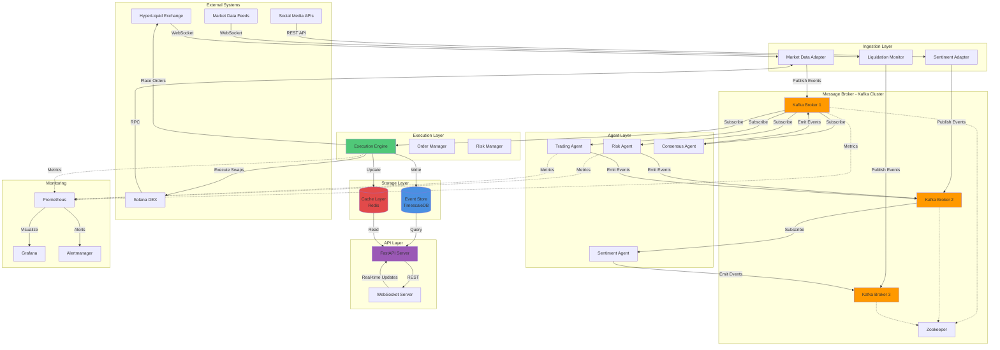

### 1.2 Layered Architecture View

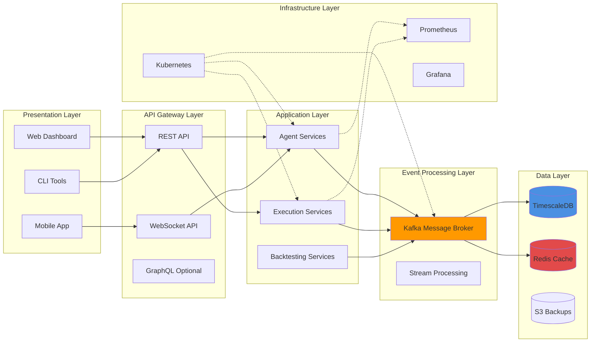

---

## 2. Component Architecture

### 2.1 Core Event System Components

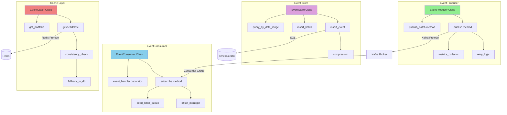

### 2.2 Agent Architecture

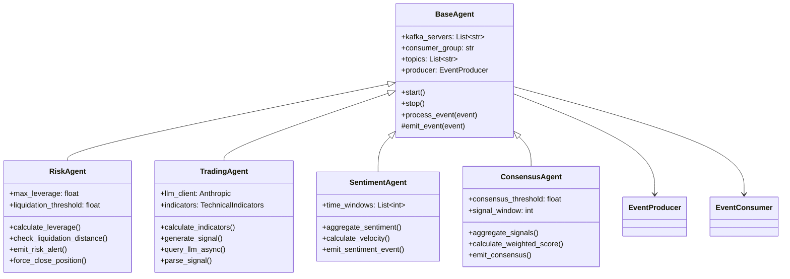

### 2.3 Execution Engine Architecture

```mermaid
graph TB
    subgraph "Execution Engine"
        EE[ExecutionEngine]
        VAL[Risk Validator]
        SIZE[Position Sizer]
        ORDER[Order Manager]
        FILL[Fill Monitor]
        
        EE --> VAL
        VAL --> SIZE
        SIZE --> ORDER
        ORDER --> FILL
    end

    subgraph "Exchange Adapters"
        HL[HyperLiquid Adapter]
        SOL[Solana Adapter]
        BASE[Base Adapter Interface]
        
        BASE <|-- HL
        BASE <|-- SOL
    end

    subgraph "Order Types"
        MARKET[Market Order]
        LIMIT[Limit Order]
        STOP[Stop Loss]
        TP[Take Profit]
    end

    KAFKA[Kafka: signal.generated] -->|Subscribe| EE
    
    VAL -->|Check Constraints| CACHE[(Redis Cache)]
    SIZE -->|Calculate Size| CACHE
    
    ORDER -->|Route| HL
    ORDER -->|Route| SOL
    
    HL -->|REST API| EX1[HyperLiquid]
    SOL -->|RPC| EX2[Solana]
    
    FILL -->|Emit| KAFKA2[Kafka: trade.executed]
    FILL -->|Update| CACHE
    FILL -->|Persist| TSDB[(TimescaleDB)]

    ORDER --> MARKET
    ORDER --> LIMIT
    ORDER --> STOP
    ORDER --> TP

    style EE fill:#50c878
    style VAL fill:#ff6b6b
    style ORDER fill:#4ecdc4
```

---

## 3. Data Flow Diagrams

### 3.1 End-to-End Trade Execution Flow

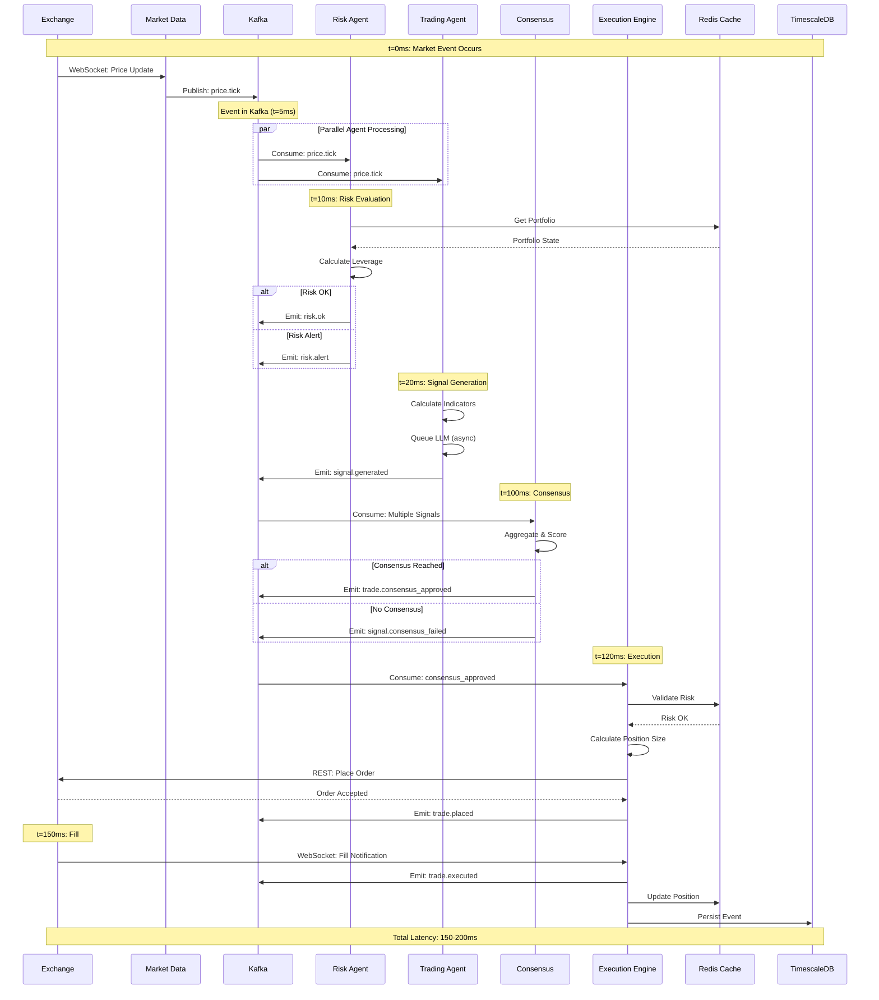

### 3.2 Risk Alert and Force Close Flow

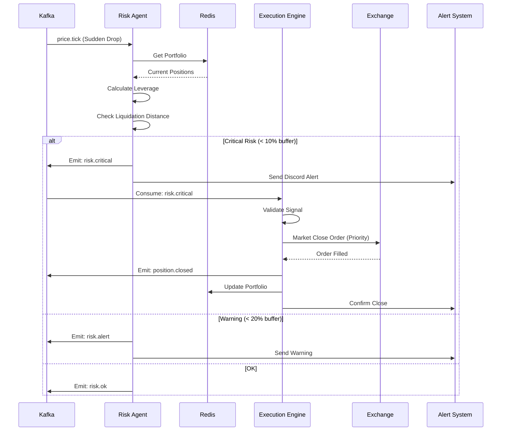

### 3.3 Backtesting Data Flow

```mermaid
graph LR
    subgraph "Backtest Initialization"
        USER[User Request]
        PARAMS[Backtest Parameters]
        USER --> PARAMS
    end

    subgraph "Historical Data"
        DB[(TimescaleDB)]
        QUERY[Query Events]
        EVENTS[Historical Events]
        
        PARAMS --> QUERY
        QUERY --> DB
        DB --> EVENTS
    end

    subgraph "Backtest Execution"
        ENGINE[Backtest Engine]
        REPLAY[Event Replay]
        AGENTS[Agent Instances]
        
        EVENTS --> ENGINE
        ENGINE --> REPLAY
        REPLAY --> AGENTS
    end

    subgraph "Results Processing"
        TRADES[Simulated Trades]
        CALC[Performance Calculator]
        METRICS[Metrics]
        
        AGENTS --> TRADES
        TRADES --> CALC
        CALC --> METRICS
    end

    subgraph "Report Generation"
        REPORT[Backtest Report]
        HTML[HTML Report]
        JSON[JSON Export]
        
        METRICS --> REPORT
        REPORT --> HTML
        REPORT --> JSON
    end

    HTML --> USER
    JSON --> USER

    style ENGINE fill:#9b59b6
    style CALC fill:#3498db
    style REPORT fill:#2ecc71
```

---

## 4. Event Flow Sequences

### 4.1 Multi-Agent Consensus Flow

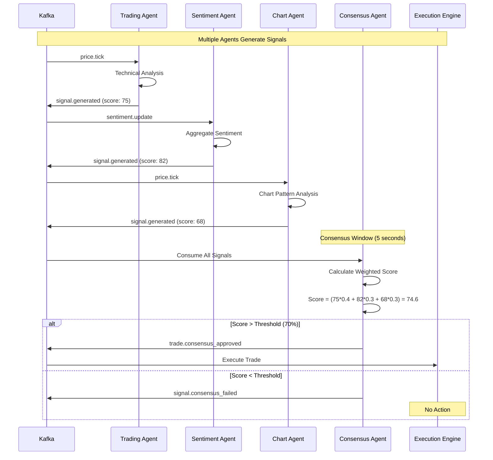

### 4.2 Event Sourcing and State Reconstruction

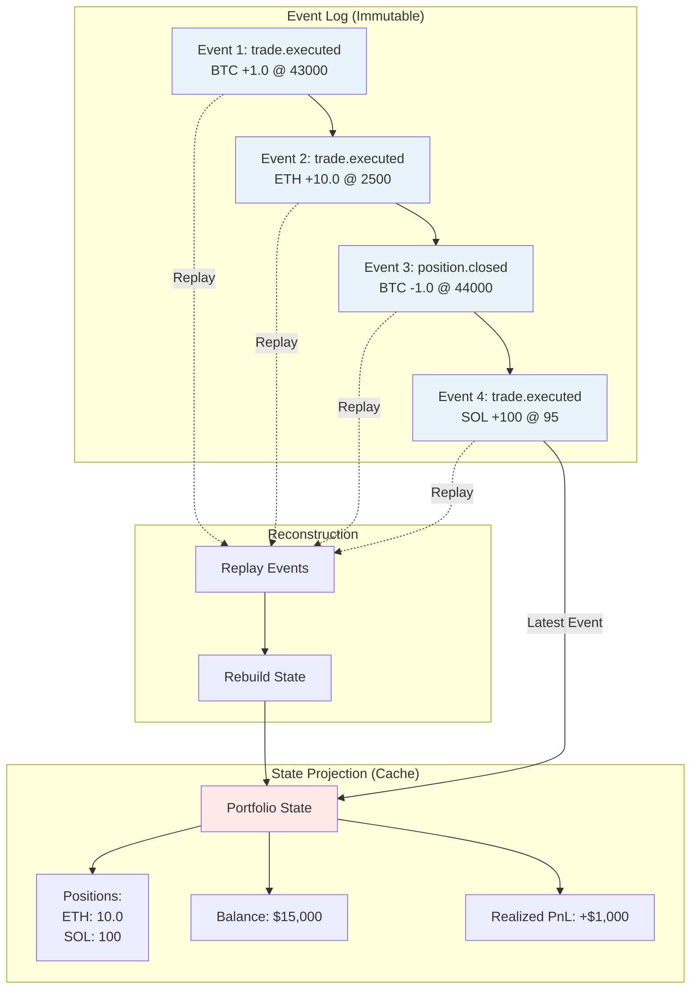

### 4.3 WebSocket Real-Time Updates

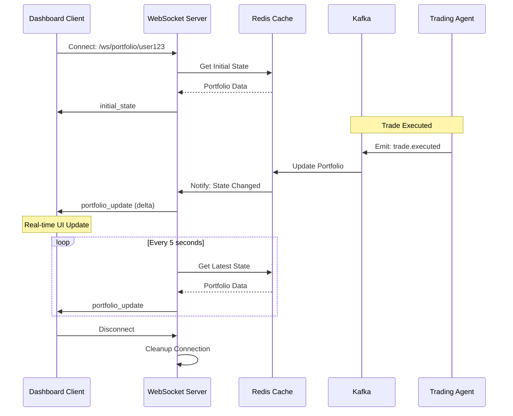

---

## 5. Deployment Architecture

### 5.1 Kubernetes Deployment

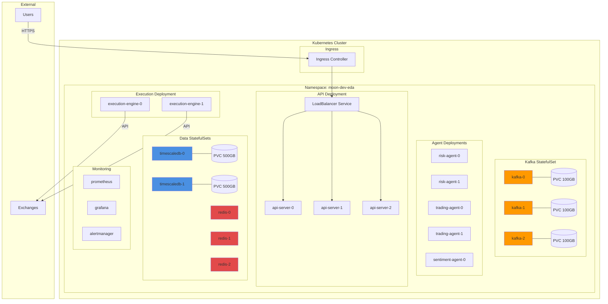

### 5.2 Network Architecture

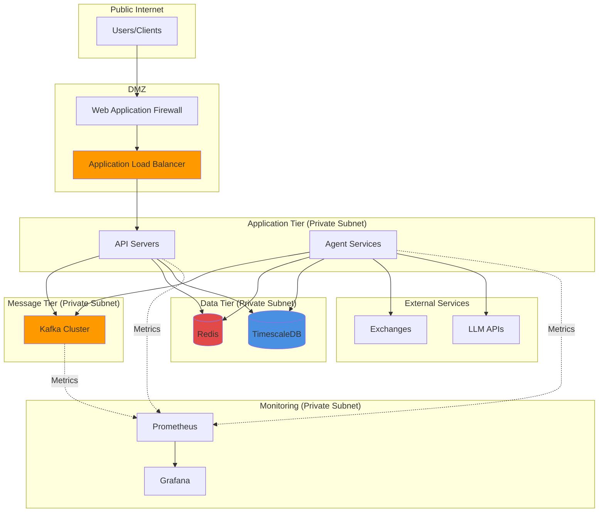

---

## 6. Agent Interaction Diagrams

### 6.1 Agent Communication Pattern

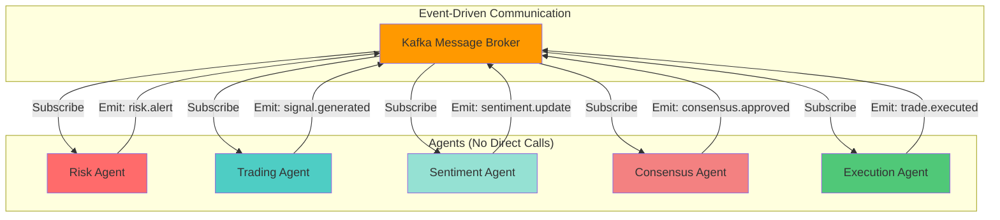

### 6.2 Agent State Machine

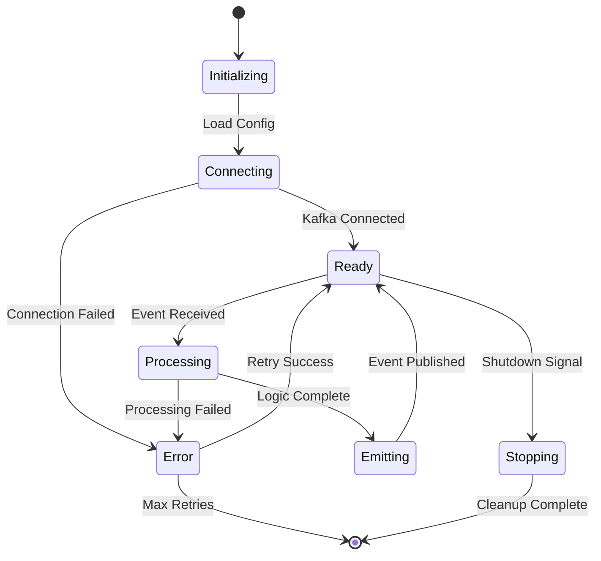

### 6.3 Consensus Mechanism

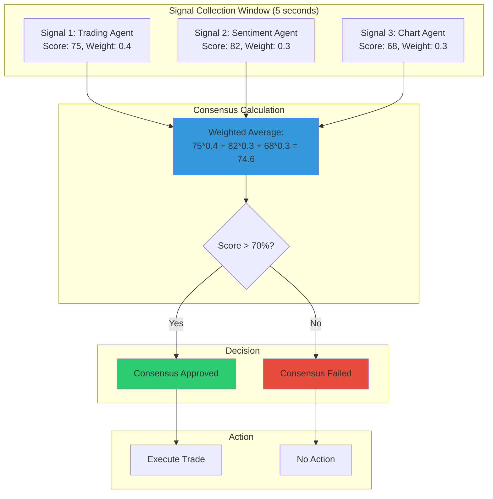

---

## Summary

These diagrams provide comprehensive visual documentation of the Moon Dev EDA implementation:

1. **System Architecture**: Shows the complete system with all components and their interactions
2. **Component Architecture**: Details internal structure of core components
3. **Data Flow**: Illustrates how data moves through the system
4. **Event Sequences**: Shows timing and ordering of events
5. **Deployment**: Kubernetes and network architecture
6. **Agent Interactions**: How agents communicate via events

All diagrams are rendered using Mermaid and can be viewed in any Markdown viewer that supports Mermaid syntax.

---

**Generated**: 2025-10-26  
**Version**: 1.0.0  
**Status**: Complete
